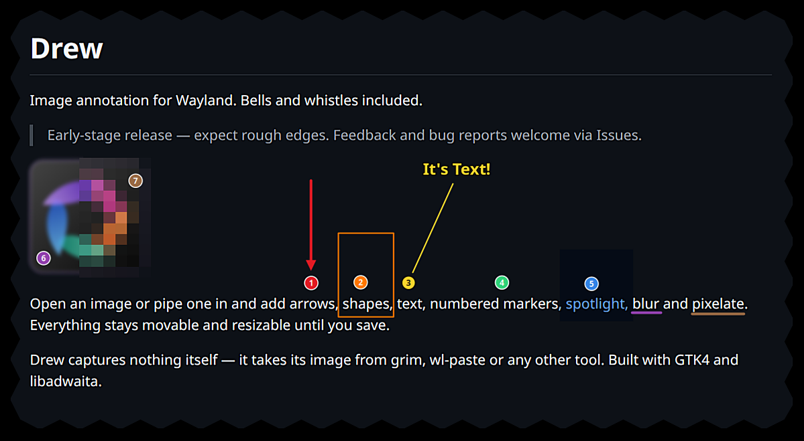

# Drew

Image annotation for Wayland. Bells and whistles included.

> Early-stage release — expect rough edges. Feedback and bug reports welcome via Issues.


Open an image or pipe one in and add arrows, shapes, text, numbered markers, spotlight, blur and pixelate, or crop it. Everything stays movable and resizable until you save.

Drew captures nothing itself — it takes its image from grim, wl-paste or any other tool. Built with GTK4 and libadwaita.



## Usage

    drew image.png
    grim -g "$(slurp)" - | drew -              # read from stdin
    grim - | drew - -o shot.png                # Ctrl+S writes here
    grim - | drew - -o - | wl-copy             # Ctrl+S writes to stdout and quits

Without `-o`, Ctrl+S writes `~/Pictures/screenshot-YYYYMMDD-HHMMSS.png` — folder and prefix are configurable in Preferences (Ctrl+,); Ctrl+Shift+S asks. The input file is never overwritten.

## Tools

| Key | Tool |
|-----|------|
| V / 1 | Select — click to select, drag to move, drag a handle to resize, double-click text to edit |
| A / 2 | Arrow (Shift snaps to 45°) |
| L / 3 | Line |
| R / 4 | Rectangle (Shift for square) |
| E / 5 | Ellipse (Shift for circle) |
| T / 6 | Text |
| M / 7 | Numbered marker — each click drops the next number; the tool stays active |
| H | Highlighter — translucent wash in the current colour, marker-pen style |
| S | Spotlight — everything outside the region is dimmed; several regions combine |
| B | Blur |
| P | Pixelate |
| C | Crop — drag a frame, Return (or a click outside it) applies; while the frame is selected it moves and resizes like any shape, draw a new one to replace it, delete it to get the whole image back |

Delete removes the selection, Esc deselects, arrow keys nudge (Shift = 10 px). Page Up / Page Down raise or lower the selected shape one step, Home / End bring it to the front or send it to the back; the same is in the right-click menu on a shape. Ctrl+Z / Ctrl+Shift+Z undo and redo, Ctrl+C copies the annotated image to the clipboard. Ctrl+scroll zooms around the pointer, Ctrl+plus/minus step, Ctrl+1 is actual size, Ctrl+0 fits the window again; middle-drag pans. The swatch button holds the properties of whatever is selected — or of the tool about to draw: colour and line width for arrows and lines, fill for rectangles and ellipses, text size, marker size, highlighter opacity, spotlight dim, blur radius, pixelate block size. Changing a value restyles the selection and becomes the default for the next shape. Fill turns rectangles and ellipses solid and puts text on a rounded chip.

## Dependencies

- Python 3.10+
- GTK 4, libadwaita 1.7+
- PyGObject, pycairo, gdk-pixbuf
- Pillow (blur and pixelate)
- Meson, Ninja, gettext (build)

## Install

### Arch Linux

```bash
pacman -S python python-gobject python-cairo python-pillow gtk4 libadwaita gdk-pixbuf2 meson ninja
makepkg -sic
```

### Debian / Ubuntu

```bash
sudo apt install ./drew_*.deb
```

Needs libadwaita 1.7 or newer (Debian 13 "trixie", Ubuntu 25.04 and later).

### From source

```bash
meson setup builddir --prefix=/usr
meson compile -C builddir
sudo meson install -C builddir
```

### Build a .deb package from source

Requires [nfpm](https://nfpm.goreleaser.com) in addition to meson and ninja. The package is written to the repository root and named after the version in `meson.build`.

```bash
./build-deb.sh
```

## Releasing

`./release.sh <version> [title]` bumps `meson.build` and `PKGBUILD`, tags, pushes to both remotes, builds the Arch package against the GitHub tarball and the .deb, publishes GitHub and Forgejo releases with both attached, and updates the AUR. The metainfo must already carry a `<release>` entry for the version, committed. The Forgejo step needs a token in the keyring: `secret-tool store --label='Forgejo release token' service forgejo host git.singular.de`.

## Configuration

Settings are stored in `~/.config/drew/settings.json` and can be changed from the Preferences dialog (Ctrl+,): the folder Save writes to and the file name prefix. The last-used colour, sizes and amounts are remembered as well.

## Troubleshooting

If you encounter issues or crashes, debug output can be enabled by running the following command in your terminal:

```bash
G_MESSAGES_DEBUG=all PYTHONUNBUFFERED=1 drew
```

## License

GPL-3.0-**only** — version 3 of the GNU General Public License, and not "or any later version".
The full text is in [LICENSE](LICENSE), the copyright notice in [COPYRIGHT](COPYRIGHT).

### Artwork and name

The application icon is licensed separately, under **CC BY 4.0**.
[COPYRIGHT](COPYRIGHT) lists the files.

The **name** is not licensed by either grant — give a fork its own.

## Credits

Drew bundles [Phosphor Icons](https://phosphoricons.com/) (MIT) for the toolbar — GPL-compatible; [COPYRIGHT](COPYRIGHT) has the details. `scripts/extract-phosphor.py` regenerates them from the Phosphor release zip.

`build-deb.sh` is based on the script [Nolan Provencher](https://github.com/ner216) contributed to Stenmark.

## Disclaimer

This project was developed with AI assistance. Use at your own discretion.
